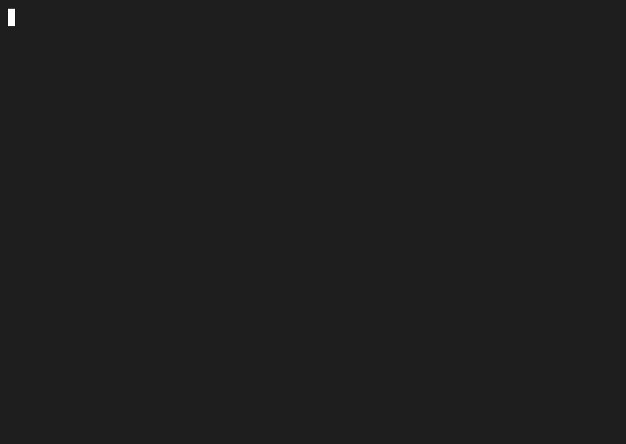

# nibble

[English](README.md)

**macOS 専用。** Chrome のブックマークからランダムに候補を提示する CLI ツールです。



## 動作環境

- macOS
- Google Chrome
- Node.js 18 以上 または Bun

## インストール

インストールなしで実行:

```bash
npx @sho-hata/nibble
```

グローバルインストール:

```bash
npm install -g @sho-hata/nibble
nibble
```

## 使い方

### 基本的な使い方

```bash
npx nibble
```

Chrome のブックマークから 5 件をランダムに提示します（`-n` で件数を変更できます）。

```
▶    読んでいない技術記事 — example.com
     積読になっている本のメモ — note.com
     気になっていたツール — github.com
     ...

j/k: move  d: remove from bookmarks  o: open in browser  Enter: confirm
```

### キー操作

| キー | 動作 |
|------|------|
| `j` / `↓` | 次の候補へ移動 |
| `k` / `↑` | 前の候補へ移動 |
| `o` | 選択中のブックマークをブラウザで開く（緑色に） |
| `d` | 選択中のブックマークを削除マーク（赤色に） |
| `Enter` | 確定（開くマーク・削除マークを実行） |
| `Ctrl+C` | キャンセルして終了 |

10 件表示したい場合:

```bash
npx @sho-hata/nibble -n 10
```

### 自動モード

```bash
npx @sho-hata/nibble --auto
```

候補を 1 件だけ選んでそのままブラウザで開きます。cron や自動化スクリプトに向いています。

```bash
# 毎朝 9 時にランダムなブックマークを開く
0 9 * * * npx @sho-hata/nibble --auto
```

## しくみ

- ブックマークの読み込み元: `~/Library/Application Support/Google/Chrome/Default/Bookmarks`

Chrome が起動中に削除を行うと、Chrome 終了時に上書きされる場合があるため、警告が表示されます。

## 開発

```bash
bun install       # 依存関係のインストール
bun run start     # ソースから実行
bun run build     # dist/ にビルド
bun run lint      # lint
bun run fmt       # フォーマット
```
